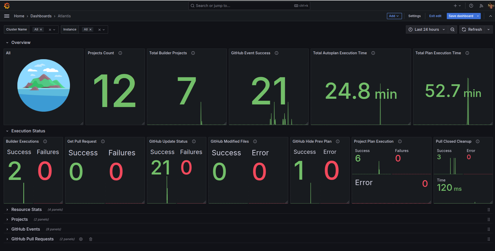
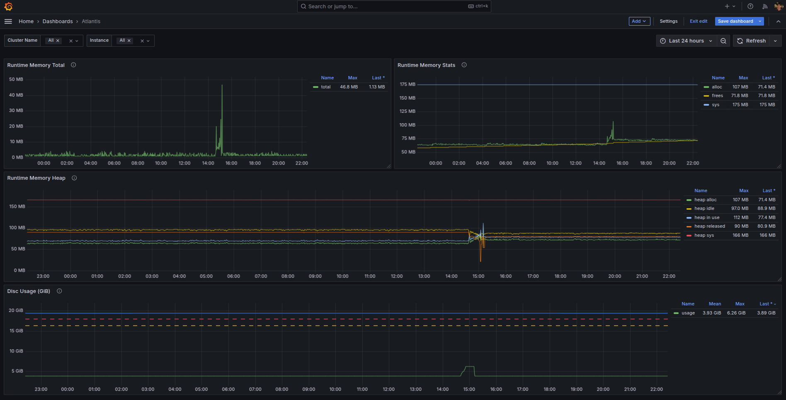
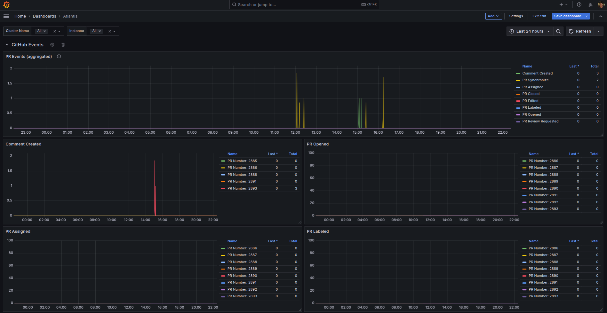
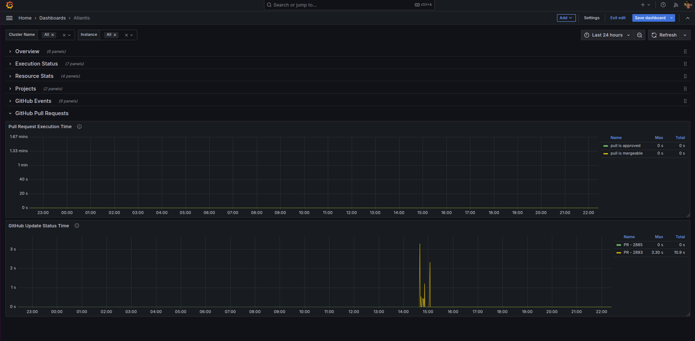

# Atlantis Grafana Dashboard

This is a grafana dashboard based on metrics provided to [Atlantis Terraform Automation](https://www.runatlantis.io/)

It was based on this documentation [Stats](https://www.runatlantis.io/docs/stats) and metrics collected directly from the application. 

## Dashboard Preview

## TODO

Implement panels for other Git providers such as:
- GitLab
- Gitea
- Bitbucket
- Azure DevOps

## Contributing

Pull requests are welcome.

 
